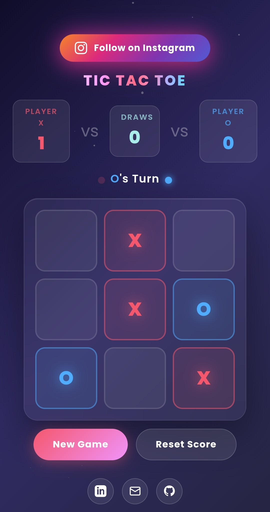

# 🎮 Tic-Tac-Toe

## 📌 Overview
Tic Tac Toe is a simple and interactive two-player game built using HTML, CSS, and JavaScript. Players take turns marking X and O on a 3×3 grid, and the game automatically detects the winner or a draw.

## ✨ Features
- Two-player gameplay
- Automatic winner detection
- Draw detection
- Restart game functionality
- Clean and responsive user interface
- Works directly in the browser

## 🛠️ Technologies Used
- HTML5
- CSS3
- JavaScript

## 🚀 Live Demo
https://muthupriyan-dev.github.io/tic-tac-toe/tic-tac-toe.html

## 💻 How to Use
1. Open the live demo link.
2. Player X starts the game.
3. Players take turns selecting cells.
4. The game announces the winner or a draw.
5. Use the restart button to play again.

## 📷 Screenshot

## 🎯 Learning Goals
This project was created to practice:
- JavaScript game logic
- DOM manipulation
- Event handling
- Responsive web design

## 🔮 Future Improvements
- AI opponent mode
- Score tracking
- Sound effects
- Dark mode

## 👨‍💻 Author
**Muthupriyan**

GitHub: https://github.com/muthupriyan-dev

